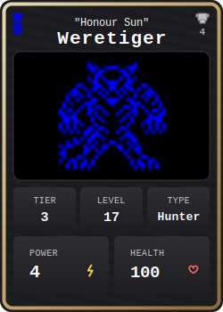
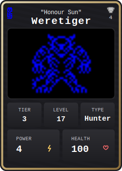
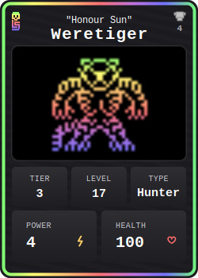
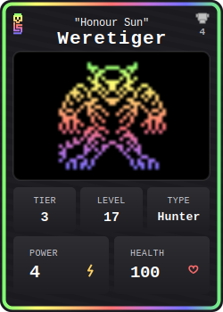

# Beasts NFT Collection

<div align="center">


[](https://github.com/starkware-libs/cairo)
[](https://starknet.io)
[](LICENSE)
[](https://codecov.io/gh/Provable-Games/beasts-g2)

</div>

**Beasts** is a fully onchain NFT collection featuring 75 unique monster species that integrate with the [Loot Survivor](https://survivor.realms.world) game ecosystem on Starknet. Each beast is dynamically generated with unique attributes, names, and stunning SVG artwork—all stored and rendered directly from the blockchain.

## 🎨 Example Beasts

<div align="center">
<table>
<tr>
<td align="center">
<!-- Not Shiny, Not Animated -->


</td>
<td align="center">
<!-- Not Shiny, Animated -->


</td>
<td align="center">
<!-- Shiny, Not Animated -->


</td>
<td align="center">
<!-- Shiny, Animated -->


</td>

</tr>
</table>
</div>

## 🚀 Features

- **🎨 Fully Onchain Artwork**: Every beast's SVG is dynamically generated and stored entirely onchain
- **🎮 Born Onchain**: The Beasts do not simply live onchain, they are born onchain from the Dungeons of Loot Survivor
- **🔮 Built for Fun**: Each Beast is minted with their original stats: {level, health, specials} and are compatible with the onchain combat system that powers Loot Survivor.
- **🏛️ 75 Unique Species**: From mystical Warlocks to fierce Minotaurs, each with distinct visual traits
- **📊 Tiered Rarity System**: 5 tiers with visual indicators through border colors and effects

## 📦 Installation

### Prerequisites

- [Scarb](https://docs.swmansion.com/scarb/) 2.11.4
- [Starknet Foundry](https://foundry-rs.github.io/starknet-foundry/) 0.46.0
- [Cairo Coverage](https://github.com/software-mansion/cairo-coverage) 0.5.0 (for test coverage)

### Setup

1. Clone the repository:

```bash
git clone https://github.com/Provable-Games/beasts.git
cd beasts
```

2. Install dependencies:

```bash
scarb build
```

3. Run tests:

```bash
scarb test
```

## 🏗️ Architecture

### Smart Contract Structure

```
src/
├── beasts_nft.cairo          # Main ERC721 contract
├── pack.cairo                # Efficient attribute packing (51 bits)
├── beast_definitions.cairo   # 75 beast species definitions
├── beast_manager.cairo       # Beast validation and management
├── metadata_generator.cairo  # Onchain JSON metadata generation
├── beast_svg.cairo          # Dynamic SVG artwork generation
├── minting_coordinator.cairo # Single and batch minting logic
└── interfaces.cairo         # External contract interfaces
```

### Beast Data Model

Each beast is efficiently packed into 51 bits:

```cairo
PackableBeast {
    id: u8,      // 7 bits - beast species (1-75)
    prefix: u8,  // 7 bits - name prefix (0-69)
    suffix: u8,  // 5 bits - name suffix (0-18)
    level: u16,  // 16 bits - beast level
    health: u16, // 16 bits - beast health
}
```

## 🎮 Beast Types & Tiers

### Beast Types

- **🔮 Magical**: Mystical creatures with arcane powers
- **🏹 Hunter**: Swift and agile predators
- **⚔️ Brute**: Raw strength and physical dominance

### Tier System

- **Tier 1**: Orange borders (Legendary) - Most powerful beasts
- **Tier 2**: Purple borders (Epic)
- **Tier 3**: Blue borders (Rare)
- **Tier 4**: Green borders (Uncommon)
- **Tier 5**: White borders (Common) - Entry level beasts

## 🧪 Testing

Run the comprehensive test suite:

```bash
# Run foundry with coverage
snforge test --coverage

# Check coverage percentage (must be ≥84.3%)
lcov --summary coverage/coverage.lcov
```

## 🚢 Deployment

1. Configure environment variables:

```bash
cp .env.example .env
# Edit .env with your configuration
```

Required in `.env` (no defaults are assumed):

- `STARKNET_ACCOUNT`, `STARKNET_PRIVATE_KEY`
- `RPC_URL` (e.g., Sepolia or Mainnet endpoint)
- `NAME`, `SYMBOL`
- `OWNER`, `ROYALTY_RECEIVER`, `ROYALTY_FRACTION` (u128, denominator 10,000)

2. Deploy to Starknet:

```bash
bash scripts/deploy.sh
```

Notes:

- The script declares and deploys the four image data provider contracts, then deploys the core NFT with their addresses passed to the constructor.
- The script fails with a descriptive error if any required `.env` value is missing.

## 🛠️ Development

### Code Style

- Run formatter before committing:

```bash
scarb fmt
```

### CI/CD

The project uses GitHub Actions for:

- Linting (scarb fmt --check)
- Testing with fuzzing
- Coverage verification (≥80% required)

## 🤝 Acknowledgments

- [Loot Survivor](https://github.com/Provable-Games/loot-survivor) - The game that Beasts integrates with
- [OpenZeppelin Cairo](https://github.com/OpenZeppelin/cairo-contracts) - Security-audited contract components
- [Starknet](https://starknet.io) - The L2 scaling solution powering Beasts

## 🔗 Links

- [Play Loot Survivor](https://deathmountain.gg/survivor)
- [Documentation](https://https://survivor-docs.realms.world/)
- [Discord Community](https://discord.gg/realmsworld)
- [Twitter](https://twitter.com/lootsurvivor)

---

<div align="center">
  <strong>Built with ❤️ on Starknet</strong>
</div>
