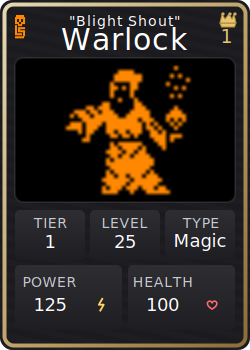
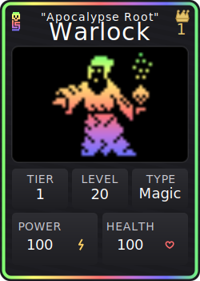
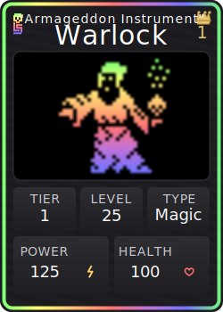

# Beasts NFT Collection

<div align="center">

</div>

**Beasts** is a fully onchain NFT collection featuring 75 unique monster species that integrate with the [Loot Survivor](https://lootsurvivor.io) game ecosystem on Starknet. Each Beast is dynamically generated with unique attributes, names, and artwork—all stored and rendered directly from the blockchain.

## Overview

The Beasts are a collection of digital-native creatures, born onchain and built for battle. With 1,243 variants across 75 species, the fixed supply of 93,225 Beasts balances abundance and scarcity. Beasts carry two sets of traits: visual and combat.

- Visual traits power collecting: Shiny and Animated forms activate pixel-perfect effects. Each Beast has live ranking within its species (1–1,243) that updates as new Beasts are minted; once a species is complete, a King Beast is crowned.
- Combat traits power play: On mint, a Beast includes level and health. Together with its type and tier, this defines a combat profile compatible with the Loot Survivor system that first brought Beasts into the world.
- Live, credibly neutral traits such as Adventurers slain, last Adventurer who defeated a Beast, and timestamp of that defeat enable long-term growth systems without hardcoding game logic.
- Beasts are earned by worthy Adventurers in the dungeons of Loot Survivor using verifiable randomness. Every step is etched onchain for permanent provenance. For collectors, Beasts offer verifiable scarcity and provenance; for players, they unlock endless onchain fun.

## 🎨 Example Beasts

<div align="center">
<table>
<tr>
<td align="center">
<!-- Not Shiny, Not Animated -->


</td>
<td align="center">
<!-- Not Shiny, Animated -->


</td>
<td align="center">
<!-- Shiny, Not Animated -->


</td>
<td align="center">
<!-- Shiny, Animated -->


</td>

</tr>
</table>
</div>

## 🚀 Features

- **🎨 Fully Onchain Artwork**: Every Beast’s image data and metadata are generated onchain
- **🎮 Born Onchain**: Beasts emerge from the dungeons of Loot Survivor
- **⚔️ Battle-Ready**: Each Beast is minted with level and health and is compatible with the Loot Survivor combat system
- **🏛️ 75 Unique Species**: From mystical Warlocks to fierce Minotaurs, each with distinct visual traits
- **📊 Tiered Rarity System**: 5 tiers with visual indicators through border colors and effects

## 📦 Installation

### Prerequisites

- [Scarb](https://docs.swmansion.com/scarb/) 2.10.1
- [Starknet Foundry](https://foundry-rs.github.io/starknet-foundry/) 0.46.0
- [Cairo Coverage](https://github.com/software-mansion/cairo-coverage) 0.5.0 (for test coverage)

### Setup

1. Clone the repository:

```bash
git clone https://github.com/Provable-Games/beasts.git
cd beasts
```

2. Build contracts:

```bash
scarb build
```

3. Run tests:

```bash
snforge test
```

## 🏗️ Architecture

### Smart Contract Structure

```
src/
├── lib.cairo                  # Entry point; exposes modules and ERC721 contract (beasts_nft)
├── pack.cairo                 # Attribute packing (id, name parts, level, health, shiny, animated)
├── beast_definitions.cairo    # 75 species definitions and names
├── beast_manager.cairo        # Validation and uniqueness hashing
├── beast_ranking.cairo        # Per-species live ranking + king logic
├── metadata_generator.cairo   # Onchain JSON metadata generation
├── beast_svg.cairo            # Dynamic SVG artwork generation
├── minting_coordinator.cairo  # Single and batch mint prep
└── interfaces.cairo           # External interfaces (image data providers, systems)
```

### Beast Data Model

Each Beast is efficiently packed into 53 bits:

```cairo
PackableBeast {
    id: u8,       // 7 bits - species (1–75)
    prefix: u8,   // 7 bits - name prefix
    suffix: u8,   // 5 bits - name suffix
    level: u16,   // 16 bits - level
    health: u16,  // 16 bits - health
    shiny: u8,    // 1 bit  - visual trait
    animated: u8, // 1 bit  - visual trait
}
```

## 🎮 Beast Types & Tiers

### Beast Types

- **🔮 Magical**: Mystical creatures with arcane powers
- **🏹 Hunter**: Swift and agile predators
- **⚔️ Brute**: Raw strength and physical dominance

### Tier System

- **Tier 1**: Orange borders (Legendary) - Most powerful beasts
- **Tier 2**: Purple borders (Epic)
- **Tier 3**: Blue borders (Rare)
- **Tier 4**: Green borders (Uncommon)
- **Tier 5**: White borders (Common) - Entry level beasts

## 🧪 Testing

Run the comprehensive test suite:

```bash
# Run foundry with coverage
snforge test --coverage

# Summarize coverage locally
lcov --summary coverage/coverage.lcov
```

CI enforces formatting and coverage on patches (≥35%); aim for ≥80% overall when feasible.

## 🚢 Deployment

1. Configure environment variables:

```bash
cp .env.example .env
# Edit .env with your configuration
```

Required in `.env` (no defaults are assumed):

- `STARKNET_ACCOUNT`, `STARKNET_PRIVATE_KEY`
- `RPC_URL` (e.g., Sepolia or Mainnet endpoint)
- `NAME`, `SYMBOL`
- `OWNER`, `ROYALTY_RECEIVER`, `ROYALTY_FRACTION` (u128, denominator 10,000)

Optional in `.env`:

- `TERMINAL_TIMESTAMP` (u64, default `0`): UNIX timestamp (seconds) after which `token_uri` is disabled and calls revert. Use `0` to keep `token_uri` active indefinitely.
- `DEATH_MOUNTAIN_ADDRESS` (ContractAddress, default `0`): external systems integration address; set to `0` to disable.

2. Deploy to Starknet:

```bash
bash scripts/deploy.sh
```

Notes:

- The script declares and deploys the four image data provider contracts, then deploys the core NFT with their addresses passed to the constructor.
- The script fails with a descriptive error if any required `.env` value is missing.
- The deploy script reads `TERMINAL_TIMESTAMP` and `DEATH_MOUNTAIN_ADDRESS` and appends them to the constructor. If `TERMINAL_TIMESTAMP > 0`, after that time, `token_uri` calls revert with `Terminal: token_uri disabled`.

## 🛠️ Development

### Code Style

- Run formatter before committing:

```bash
scarb fmt
```

### CI/CD

The project uses GitHub Actions for:

- Linting (scarb fmt --check)
- Testing with fuzzing
- Coverage verification (patch ≥35%)

## 🤝 Acknowledgments

- Beast pixels from the legends at [1337 Skulls](https://1337skulls.xyz)

## 🔗 Links

- [Play Loot Survivor](https://lootsurvivor.io)
- [Discord Community](https://discord.gg/lootsurvivor)
- [Twitter](https://x.com/lootsurvivor)
- [Beast NFT](https://voyager.online/contract/0x046da8955829adf2bda310099a0063451923f02e648cf25a1203aac6335cf0e4)
- [Regular PNG URI](https://voyager.online/contract/0x07bcd91940f5a2640437c764815b6a8a173f09fff991420b691713bebd82f7bf)
- [Shiny PNG URI](https://voyager.online/contract/0x03bdFdEeA997CA7C7b1d66590a541FC559cE5A742e0162fE98Fe371E70709444)
- [Regular GIF URI](https://voyager.online/contract/0x012F11AD850839d27351Bbf49858A3180AdB1C30d9942423FD089F5740776293)
- [Shiny GIF URI](https://voyager.online/contract/0x0700f224e6fcb344c27f29e62687333b589b3be39a2c026ede5968bf53b6bb2a)

---

## Acknowledgments
